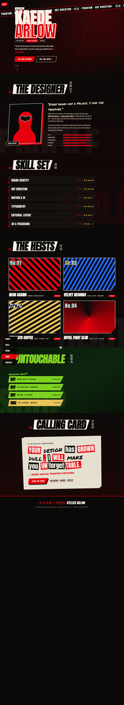

# TAKE YOUR DESIGN — a Persona-inspired designer landing page

A one-page portfolio for the (fictional) art director **Kaede Arlow**, built to feel
like an ATLUS in-game menu — Persona 5's acid red/black comic-punk UI, with nods to
Persona 3 Reload's slanted name-plates and Metaphor: ReFantazio's gold flourishes.



## What's in it

- **Title / "Press Start" screen** with an animated logo that swipes away into the site
  (Persona panel-sweep transition).
- **Pause-menu side nav** — items cascade in skewed and snap red on hover; clicking does
  the full-screen swipe transition between sections.
- **Hero** — giant name with offset red shadow, scrolling katakana marquee, a parallax
  silhouette that tracks the mouse, and a Confidant "Arcana / Rank X" card.
- **About** — a halftone "Confidant" portrait + animated S-Link style stat bars.
- **Skill set** — menu rows with gold star ratings and SP costs (Persona skill list).
- **The Heists** — project cards with tilt-on-hover and hard offset shadows.
- **Untouchable** — an Iwai-style shop with green chain-link fence and slanted `BUY` buttons.
- **Calling Card** — a ransom-note contact section (Phantom Thieves calling card).
- **ALL-OUT ATTACK** — click any red attack button (or press `P`) for a comic splatter burst.
- Custom reticle cursor, halftone textures, and `prefers-reduced-motion` support.

Everything is **original SVG/CSS art** — no game screenshots are embedded — so the page is
self-contained and yours to ship.

## Run it

It's a static site (no build step). From this folder:

```bash
python3 -m http.server 8000
# then open http://localhost:8000
```

Any static server works. Opening `index.html` directly via `file://` mostly works too,
but a server is recommended so the Google Fonts / GSAP CDN load cleanly.

### Handy URL flags (for screenshots / deep links)

- `?preview` — skip the title screen and reveal all content immediately.
- `?preview&only=skills` — show a single section by id (`about`, `skills`, `work`, `shop`, `contact`).
- `?preview&flat` — collapse full-height sections for a single tall capture.

## Tech

- Plain HTML/CSS/JS — no framework, no bundler.
- [GSAP + ScrollTrigger](https://gsap.com/) (CDN) enhance the scroll/transition animations;
  the site stays fully functional if the CDN is blocked (graceful fallback to CSS + IntersectionObserver).
- Fonts: Anton, Bebas Neue, Oswald, Permanent Marker, Noto Sans JP (Google Fonts).

## Make it yours

- Text, project names and prices live directly in `index.html`.
- Brand colors are CSS variables at the top of `css/style.css` (`--red`, `--ink`, `--bone`,
  plus the `--blue` / `--gold` / `--green` accents).
- Swap the SVG silhouette/portrait paths in `index.html` for your own art.

---

*Fan-made tribute. Persona, Metaphor: ReFantazio and related marks belong to ATLUS / SEGA.
This project ships no copyrighted assets.*
